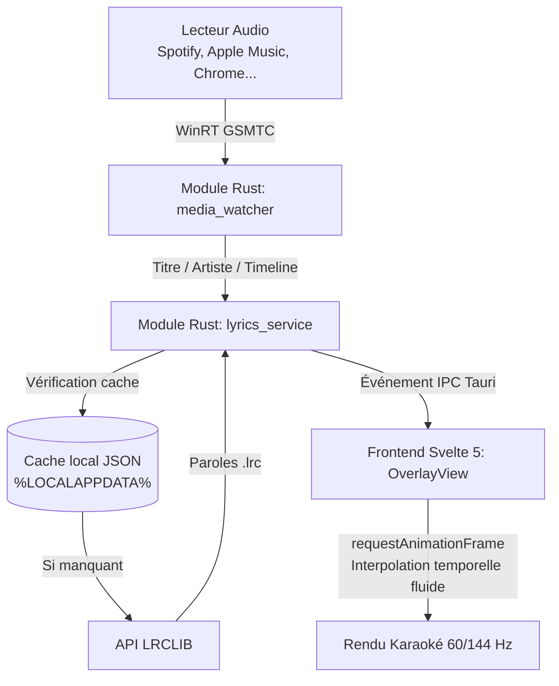

# GhostLyrics — Architecture & Design Specification

> **GhostLyrics** est une alternative open source et ultra-légère à l'application *Lyric Overlay*. Elle affiche les paroles synchronisées (style karaoké) par-dessus vos fenêtres et jeux vidéo sur Windows, avec détection automatique de la musique et mode *click-through*.

---

## 1. Résumé de compréhension & Objectifs

- **Problème résolu :** Permettre aux utilisateurs de suivre les paroles de leurs musiques en temps réel sans quitter leur jeu ou leur espace de travail, sans dépendre d'abonnements payants ni de restrictions de requêtes.
- **Cible :** Utilisateurs Windows 10/11 écoutant de la musique sur Spotify, Apple Music, YouTube Music (PWA/navigateurs), VLC, Deezer, etc.
- **Principes clés :**
  - **Légèreté absolue :** Empreinte mémoire cible `< 35 Mo` de RAM, utilisation CPU `< 0.5 %` au défilement, 0 % au repos.
  - **Zéro friction / Zéro login :** Détection native via Windows Media Transport Controls (WinRT GSMTC). Aucun compte utilisateur ni configuration de jeton OAuth requise.
  - **Transparence et non-intrusion :** Mode *Click-Through* (la souris clique directement à travers l'overlay pour ne pas perturber les jeux vidéo ou le travail).

---

## 2. Stack Technique & Décisions d'Architecture

| Composant | Technologie | Justification |
| :--- | :--- | :--- |
| **Framework d'application** | **Tauri v2** | Empreinte mémoire minime (~20-30 Mo) comparée à Electron (~200 Mo), sécurité, performances natives Rust. |
| **Backend & Intégration OS** | **Rust** (crates `windows`, `reqwest`, `serde`) | Accès bas niveau direct à WinRT GSMTC et aux styles de fenêtre Win32 (`WS_EX_TRANSPARENT`, `WS_EX_LAYERED`). |
| **Frontend UI** | **Svelte 5 + Vite + TypeScript** | Moteur réactif sans Virtual DOM, bundles ultra-compacts, interpolation d'animation fluide à 60/144 Hz. |
| **Style & Design** | **Tailwind CSS v4** | Stylage moderne, thèmes personnalisables, gestion aisée des transparences et du flou d'arrière-plan (`backdrop-blur`). |
| **Source de paroles** | **API LRCLIB** (`https://lrclib.net`) | Base de données de paroles synchronisées libre et gratuite, format `.lrc` standard. |
| **Raccourcis globaux** | `tauri-plugin-global-shortcut` | Capture du raccourci clavier global (ex: `Ctrl + Shift + L`) même quand l'application n'a pas le focus. |

---

## 3. Architecture des Fenêtres (Bi-fenêtre)

1. **Fenêtre `overlay` :**
   - Transparente (`transparent: true`), sans décorations (`decorations: false`), toujours au premier plan (`always_on_top: true`), non-focusable (`focusable: false`).
   - Deux états d'interaction :
     - **Mode Édition (Déverrouillé) :** L'utilisateur peut déplacer l'overlay sur son écran et le redimensionner via ses poignées.
     - **Mode Fantôme (Verrouillé / Click-Through) :** `set_ignore_cursor_events(true)` activé via Win32. Les clics de souris traversent l'overlay sans l'interrompre.
2. **Fenêtre `settings` :**
   - Fenêtre standard de configuration, masquée par défaut.
   - Accessible depuis l'icône dans la barre des tâches (System Tray).
   - Permet de personnaliser : taille de police, opacité du fond, couleurs, raccourci global, décalage temporel (+/- ms) et importation manuelle de fichiers `.lrc`.

---

## 4. Flux de Données & Synchronisation

### Algorithme d'interpolation temporelle (Client-side)
1. Rust transmet l'état média `{ position_ms, last_updated_time, is_playing, playback_rate }`.
2. Svelte 5 calcule en continu dans sa boucle `requestAnimationFrame` :
   $$\text{position\_actuelle} = \text{position\_ms} + (\text{temps\_courant} - \text{last\_updated\_time}) \times \text{playback\_rate} + \text{offset\_utilisateur}$$
3. La ligne active de paroles est déduite immédiatement, et le conteneur applique une translation verticale douce (`transform: translateY(-...px)`).

---

## 5. Journal des Décisions (Decision Log)

- **2026-09-16 :** Nom officiel retenu : **GhostLyrics**.
- **2026-09-16 :** Plateforme cible initiale : **Windows 10/11** via WinRT GSMTC (portabilité macOS/Linux prévue en v2).
- **2026-09-16 :** Framework UI : **Svelte 5** préféré à React pour minimiser l'overhead mémoire et garantir un défilement 60+ FPS parfait.
- **2026-09-16 :** Contrôle des réglages : **System Tray** pour préserver la propreté visuelle de l'overlay.
- **2026-09-16 :** Dépôt GitHub distant : `https://github.com/angelolockdev/GhostLyrics`.
